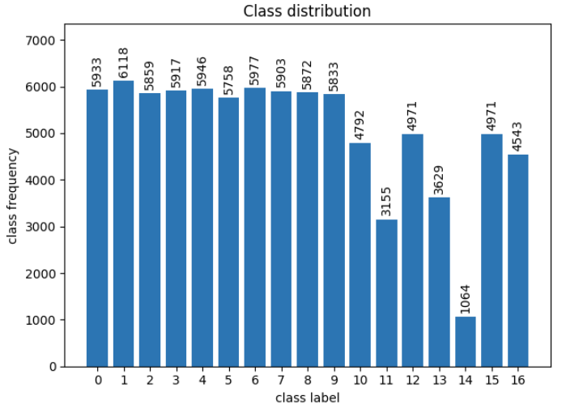
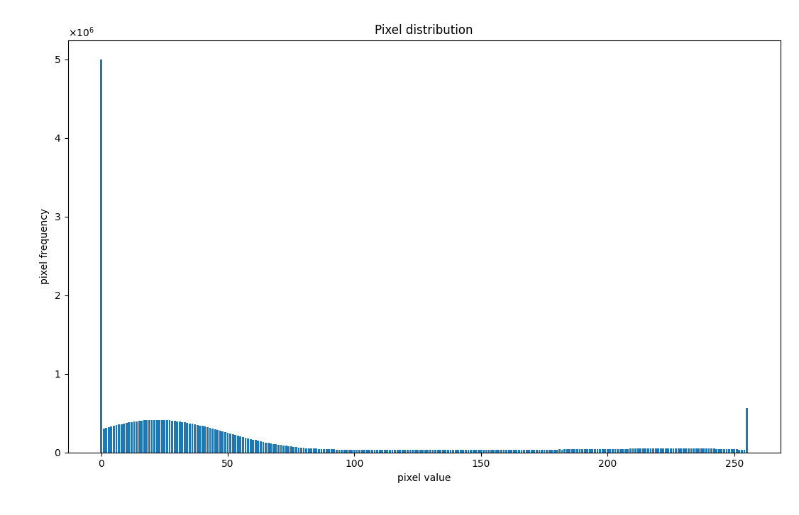
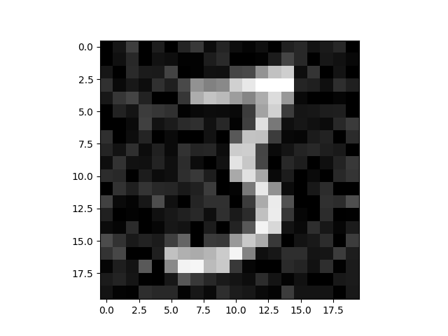
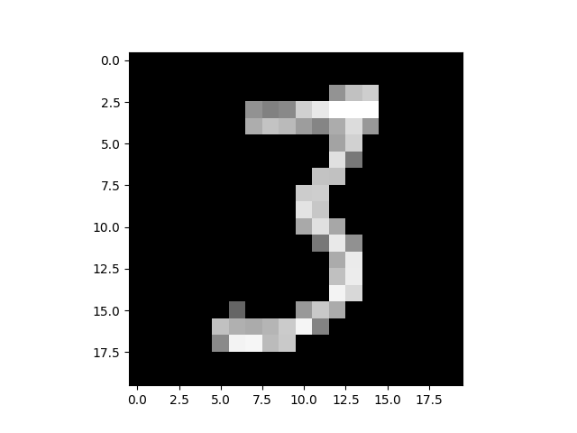

## Data exploration

### Class Distribution

There is more data on digits than letters.
The letter E(14) is only a small portion of the entire dataset.
Unbalanced dataset? -> better classification of digits than letters 
will probably struggle to classify E

I am using StratifiedKfold cross validation to mitigate uneven class distribution.
This preserves the distribution when running cross validation. The models will not 
be skewed as much towards the majority classes.

### Image data

Every pixel with values less than 100 is set to 0 to reduce noise in the images.
Every pixel over 250 is set to 255 to highlight the 'root' of the digit/letter.
The rest of the values are kept as is to preserve details of the digits/letters.

Before

After

## Metrics

I am using accuracy score to evaluate models

