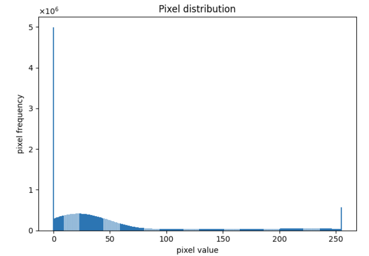
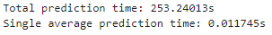
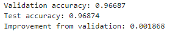
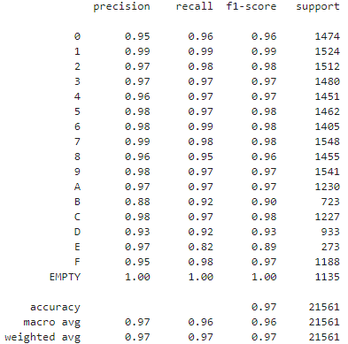
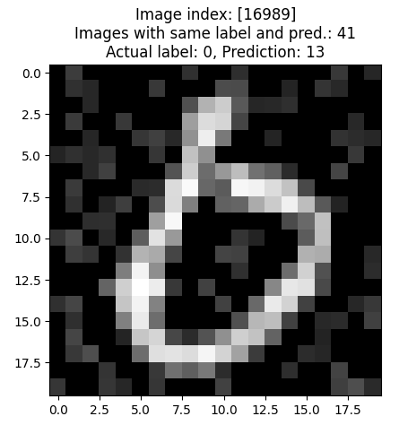
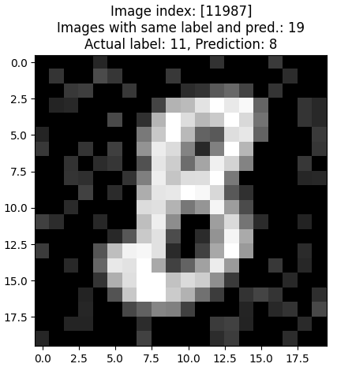
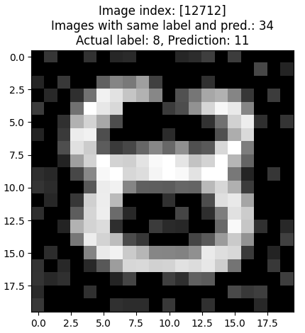

# Summary

This project aims to deliver a machine learning model which can reliably classify digits on presents
on a conveyor belt in Santas' workshop. The project includes data pre-processing, data exploration,
model selection and results of the selected best model.

Based on the results in the technical report, a machine learning model could be used 
for the given task. The current model achieves an accuracy score of 97%.
Further improvements in a future version could achieve higher accuracy given enough time 
and computational power.

The model is able to predict 100 images a second. This should be sufficient enough with respect
to time, unless 
Santas' workshop has incredibly fast conveyor belts.

I expect the real-life performance to be adequate for the given task. The model will be able to 
correctly classify and sort the majority of presents, but some supervision is needed to ensure 
that every present is correctly sorted.

\newpage

# Technical report

## Data exploration and Pre-processing

Training set contains 86241 images and makes up 80% of the dataset.
Test set contains 21561 images and makes up 20%.

Data exploration is done on the training set. If the whole data set was used, implicit bias would be introduced
when exploring data.

Data exploration is implemented in the DataExploration class.

### Pixel distribution and pixel filter

The majority of pixels in the dataset have the value 0, e.g completely black.
Most of the pixels in the lower end can be attributed to noise in the dataset.
Pixels in the upper end makes up the digits in the dataset.
Values in between are either noise or details.
I decided to keep most of the values in between to preserve details,
but reduce some noise as you in Figure 3.

{width=60%}
{width=60%}
\begin{figure}[!h]
\caption{Distribution before and after filtering}
\end{figure}

Pixels with values less than 35 are set to 0, and pixels over 250 are set to 255.
The cutoff values of 35 and 250 were chosen somewhat arbitrarily.
I tested the effects of a few different cutoff values on a smaller subset of the training data,
and the values that achieved the best validation accuracy were chosen.
A more appropriate approach would be to automaticly test values, but I decided to just
pick somewhat decent values and focus on the model valuation and selection instead.

\newpage

### Class Distribution

There is more data on numbers than letters.
With the letters B(11), D(13), and E(14) occupying a smaller portion than the rest of the digits.
The dataset is unbalanced and could therfore lead to better predictions on numbers than letters.

I am using StratifiedKfold cross validation to mitigate the uneven class distribution.
This preserves the distribution when running cross validation.
The models will not be skewed as much towards the majority classes.
Oversampling or undersampling could have been used to ensure a more 
even distribution of the classes. I did not consider that until the end of this project,
but by then I did not have enough time to implement it.

\newpage

### Processing

Data processing is implemented in the DataPreprocessing class.

There is only applied two preproccesing steps on the dataset.
The first one is pixel value cutoffs, which I covered in 2.1.1 about Pixel distribution.

As you can see below, the image after processing still contains noise.
However, it separates the digit from the noise, making it easier to distinguish 
the digits from the background, while still preserving details in the digits themselves.

{width=50%}
{width=50%}
\begin{figure}[!h]
\caption{Image before and after filtering}
\end{figure}

The second is linear scaling of pixel values.
All pixel values are fit between 0 and 1.
I tested the validation performance on a subset of the training data, with and without scaling.
My observations were that there is no difference in model accuracy, but the training time is reduced.
For that reason I chose to only use linear scaling when training the models on the entire training set.

### My prediction on model performance:

1. The model could struggle to differantiate between B and 8, 0 and D, as these digits can be very similar when handwritten.
2. The model could have a lower accuracy on E, since there is less available data on it.
3. Empty labels could be easy to predict, as there are almost no pixel values in the higher range in those images.

\newpage

## Candidate model and hyperparameters

For this assigment I have chosen 4 classification models:

- Support Vector Machine
- KNearestNeighbor
- Random Forest
- MultiLayer Perceptron

I chose these models as they have been covered in the lectures.

Due to the amount of time needed for training, some hyperparameters are left out. 
To determine which hyperparameters to use for each model, I trained each model
on a smaller amount of the training data and compared validation accuracy for the different 
parameter combinations. The best combinations were kept, while others discarded.
Ideally I would want to test all combinations on the whole training set, as some parameters
could perform better on larger amount of data.
Parameters that are not specified, use the models default value.

### Support Vector Classifier

Parameters:

- kernel: rbf
- gamma: 0.1, 0.01, 0.001, 0.0001
- C: 1, 10, 100, 1000

I am anticipating that SVC will take a considerable amount of time 
to train and for prediction due to the large amount of data.
However I think it will be interesting to compare its accuracy 
with the other models and see if it is viable to use when time is a concern.

### Random Forest Classifier

Parameters:

- criterion: gini, entropy
- max_features: sqrt, log2
- min_samples_split: 2, 6, 10

\newpage

### KNearest Neighbors Classifier

Parameters:

- n_neighbors: range from 1 to 21 included
- weights: uniform, distance
- metric: manhattan, minkowski, euclidean
    
### Multi Layer Perceptron Classifier

Parameters:

- hidden_layer_sizes: (50,), (100,), (200,), (300,), (50, 10), (100, 20), (200, 40), (300, 80)
- activation: tanh, relu
- alpha: 0.0001, 0.001, 0.01

Epochs(max_iter) are set to 800 to ensure that the models converge.

## Performance measures

I have used accuracy score as the performance measure for cross validation 
and model selection. I considered using prediction time of the models as well during model selection,
but decided to only use accuracy score. I include the prediction time for visualization
but not as a performance measure.

\newpage

## Training and Model selection

Model training and cross validation is implemented in the ModelOptimization class.
The training itself is run with the script train_and_save.py.

I have used GridSearchCV from sklearn to implement cross validation to avoid overfitting. It uses 5 stratified folds.
After each cross validation, the results from each model are stored as a dictionary in a pickle file for later use.
The validation score, mean fit time, mean prediction time, total cross validation time,
and, the model trained with the best hyperparameters on the complete training set can be accessed by the models name.

For model selection only validation score is used.
The other values are used for visual comparisons and debugging purposes.

Notable observations:

- Even though SVC is the model with the highest accuracy, the other models have a significantly faster prediction time.
- MLPC rivals SVC in accuracy, and is much faster. Since model selection only use accurcy as a metric, 
we miss out on potential time reduction when predicting.

{width=45%}
{width=80%}
\begin{figure}[!h]
\caption{Validation metrics and results}
\end{figure}

\newpage

## Final classifier

The best model is a Support Vector Machine Classifier(SVC) with the following parameters:

- kernel = rbf
- C = 10 
- gamma = 0.1 

The SVM algorithm tries to find the optimal hyperplane in an N-dimensional space
that can separate the data points in different classes in the feature space.

The kernel is a function which maps the original input data into high-dimensional feature spaces.
This model uses the radial basis function(rbf) as a kernel.
The regularization parameter C balances margin maximisation and misclassification fines.
The gamma is the kernel coefficient.

### Time and accuracy

The classifer takes 253s/4.2 minutes to classify all images in the test set.
For one prediction it takes around 0.01s.
Which means the model can do 100 predictions per second.
Unless Santas' workshop has incredibly fast conveyor belts, the chosen model 
should be more than fast enough to reliably predict given images.

Test accuracy is higher than validation accuracy, but only by a fraction.
The model has generalized to unseen data and not overfit.

\begin{figure}[!h]
\caption{Prediction time and accuracy comparison on final classifier}
\end{figure}

\newpage

### Confusion matrix and example predictions

Looking at the confusion matrix in Figure 6, the model correctly predicts the majority of the labels.
The model struggles the most with differentiating between D and 0, then B and 8.
This is still only a small fraction of all the labels.
Examples can be seen in Figure 7 and 8.
All empty labels are correctly predicted.

This confirms my initial predictions, except for lower accuracy on E.

In the classification report (Figure 6) all digits have a precision of over 90%
except for B, with 88%.

The digit E has a significantly lower recall than the other digits. This makes sense
as it is a smaller fraction of the dataset compared to the other digits.

{width=70%}
{width=60%}
\begin{figure}[!h]
\caption{Confusion matrix and classification report}
\end{figure}

{width=50%}
{width=50%}
\begin{figure}[!h]
\caption{Example of similarity between 0 and D}
\end{figure}

{width=50%}
{width=50%}
\begin{figure}[!h]
\caption{Example of similarity between 8 and B}
\end{figure}

\newpage

## Possible improvements

If given more time and computational resources I would have considered these points:

- PCA
- Testing of different filter cutoff values
- More hyperparameter tuning.
- Oversampling?
- Use GPU when training models

Running a Prinicipal Component Analysis, using different percentages of explained variance 
as hyperparameters, could reduce dimensionality and training time on the dataset.
In the same way, I could use different cutoff values for the color filter to find the optimal
values instead of arbitrarily choosing values.

Running cross validation with more hyperparameter combinations to get an even better model.
I would have especially tried more variations of the hidden layers on the MLP Classifier.

The use of an oversampler to equalize the class distribution. This could possibly increase
the accuracy.

Another possible improvement would be to utilize the GPU of my computer to reduce training times,
making it possible to test more hyperparameter combinations.

